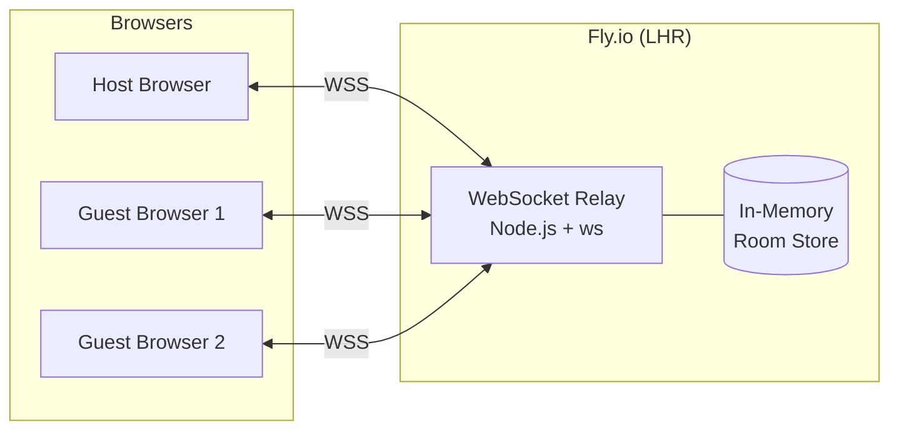
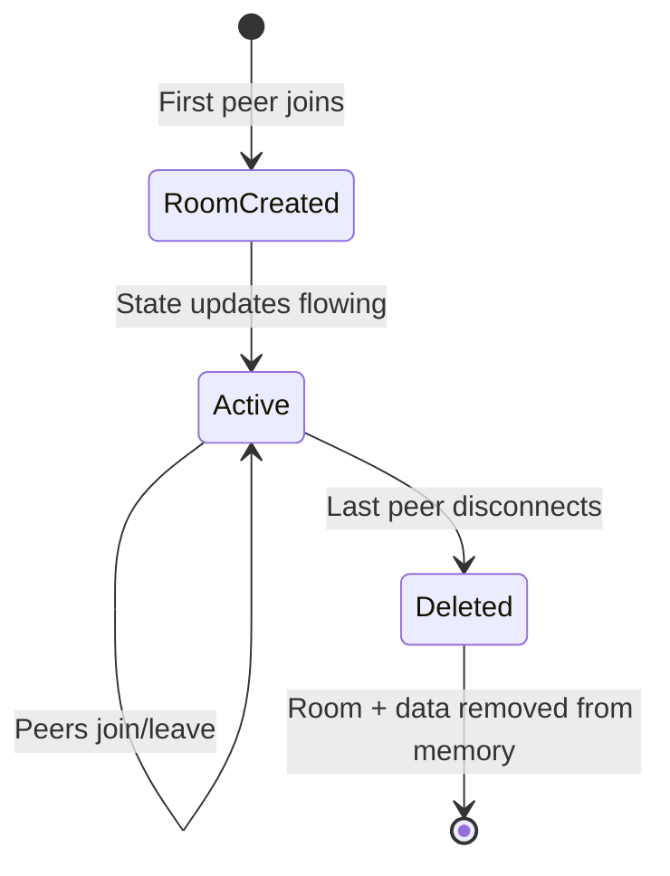

# Discovery Canvas Relay — Architecture & Security

## Overview

The Discovery Canvas relay is a lightweight WebSocket server that enables real-time
collaboration between browsers. It replaces Liveblocks (a third-party SaaS) with a
self-hosted service that stores **zero data to disk**.



## Data Flow

1. **Host creates a room** → relay allocates an in-memory room object
2. **Guests join** → relay sends them the cached canvas state (if any)
3. **Any peer edits** → client sends full canvas state as JSON → relay caches it
   and broadcasts to all other peers in the room
4. **Peer disconnects** → removed from room, presence updated
5. **Last peer leaves** → room and all cached data are **permanently deleted**

## What Data Exists and Where

| Location | Data | Lifetime |
|----------|------|----------|
| Browser `localStorage` | Canvas state (cards, layout, pain scores) | Until user clears it or ends session |
| Relay server RAM | Latest canvas state snapshot per room | Until room empties (seconds to hours) |
| Disk / Database | **Nothing** | N/A |
| Network (in transit) | WebSocket frames (JSON) | Ephemeral — not logged |

### Key Privacy Properties

- **No database** — the server has no filesystem writes, no SQLite, no Redis
- **No logs of content** — only lifecycle events are logged (room created/deleted)
- **Automatic cleanup** — rooms self-destruct when empty
- **Server restart = full wipe** — all in-flight rooms are lost on redeploy/restart
- **No authentication tokens stored** — the relay has no auth system (rooms are access-controlled by knowing the 6-character code)

## Protocol

All messages are JSON over a single WebSocket connection per client.

### Client → Server

| Type | Payload | Purpose |
|------|---------|---------|
| `join` | `{room, nickname, color}` | Join or create a room |
| `create` | `{room, nickname, color}` | Explicitly create a room |
| `state-update` | `{state: {cards, meta}}` | Push full canvas state |

### Server → Client

| Type | Payload | Purpose |
|------|---------|---------|
| `joined` | `{room, state?}` | Confirm join; includes cached state for late joiners |
| `room-created` | `{room}` | Confirm room creation |
| `presence` | `{peers: [{clientId, nickname, color}]}` | Full peer list (sent on every join/leave) |
| `state-update` | `{state, from}` | State broadcast from another peer |

## Server Architecture

```
server/
├── index.js          # ~150 lines — the entire server
├── package.json      # Only dependency: `ws` (WebSocket library)
├── Dockerfile        # Alpine Node 20, single-stage build
├── fly.toml          # Fly.io deployment config
└── README.md         # Quick-start guide
```

### In-Memory Data Structure

```javascript
// rooms: Map<roomCode, Room>
// Room = {
//   peers: Map<peerId, { ws, nickname, color }>,
//   state: object | null   // latest canvas snapshot
// }
```

- `peerId` is an auto-incrementing integer (resets on server restart)
- `state` is the full canvas JSON (cards array + metadata)
- Typical room state size: 5–50 KB (depends on number of cards)

### Lifecycle



## Deployment

### Hosting: Fly.io

| Property | Value |
|----------|-------|
| App name | `discovery-canvas-relay` |
| URL | `wss://discovery-canvas-relay.fly.dev` |
| Region | `lhr` (London) |
| VM | `shared-cpu-1x`, 256 MB RAM |
| Scaling | 1 machine (single instance for WebSocket affinity) |
| Auto-stop | Enabled (VM sleeps when no connections) |
| Auto-start | Enabled (wakes on incoming request) |
| Cost | Free tier (3 shared VMs included) |

### Why Single Machine?

WebSocket connections are stateful. If two machines exist, peers in the same room
might connect to different servers and never see each other. A single machine
ensures all room members share the same in-memory store.

For future scaling beyond ~500 concurrent users, options include:
- Redis pub/sub between machines
- Fly.io `fly-replay` header to pin rooms to specific machines
- Consistent hashing based on room code

### Deployment Commands

```bash
cd server
fly deploy          # Build + ship new version (rolling restart)
fly status          # Check machine status
fly logs            # Stream server logs
fly scale count 1   # Ensure single machine
```

## Security Considerations

### Threat Model

| Threat | Mitigation |
|--------|-----------|
| Eavesdropping in transit | WSS (TLS) — all traffic is encrypted |
| Unauthorized room access | 6-char alphanumeric code (1.5M combinations) — short-lived rooms reduce window |
| Data persistence after session | No disk storage; room deleted when empty |
| Server compromise | No secrets on server; no stored data to exfiltrate |
| DDoS / abuse | Fly.io provides basic DDoS protection; can add rate limiting |
| Cross-room data leakage | Rooms are isolated Map entries; no shared state |

### What Passes Security Review

✅ **No PII stored** — nicknames and colors exist only in RAM during session  
✅ **No third-party data processors** — self-hosted on your Fly.io account  
✅ **Data sovereignty** — server runs in London (LHR); data never leaves region  
✅ **Automatic data deletion** — no manual cleanup needed  
✅ **No authentication secrets** — no API keys, no OAuth tokens  
✅ **Minimal attack surface** — 150 lines of code, 1 dependency (`ws`)  
✅ **Open source** — full code is in `server/index.js`, auditable  

### Potential Hardening (Future)

- **Room passwords** — require a shared secret to join
- **Rate limiting** — cap connections per IP
- **E2E encryption** — encrypt state client-side before sending (server sees only ciphertext)
- **Room expiry** — auto-delete rooms after N hours even if connected
- **IP allowlisting** — restrict to corporate network

## Comparison: Liveblocks vs Self-Hosted Relay

| Aspect | Liveblocks | Self-Hosted Relay |
|--------|-----------|-------------------|
| Data storage | AWS (US/EU), persisted until deleted | RAM only, deleted on disconnect |
| Third-party access | Liveblocks staff can access | No third-party access |
| Data residency | Depends on Liveblocks plan | You choose (LHR) |
| Cost | Free tier (250 MAU), then paid | Free (Fly.io free tier) |
| Dependencies | SDK + API key | 1 npm package (`ws`) |
| Compliance | Liveblocks SOC2 (on paid plan) | Your own infrastructure |
| Uptime | Managed SLA | Self-managed |
| Offline/restart | Data persists | Data lost (by design) |

## Client Integration

The browser-side code (`public/js/collab.js`) connects via:

```javascript
const RELAY_URL = location.hostname === 'localhost'
  ? 'ws://localhost:8787'
  : 'wss://discovery-canvas-relay.fly.dev';
```

State sync uses a **last-writer-wins** model with a 300ms throttle to coalesce
rapid edits. A `syncing` flag prevents pull-during-push race conditions.

## Monitoring

```bash
# Health check (returns room count)
curl https://discovery-canvas-relay.fly.dev/health
# {"status":"ok","rooms":0}

# Live logs
fly logs -a discovery-canvas-relay
```

The server logs only:
- Room created / deleted events
- No canvas content or user data is ever logged
